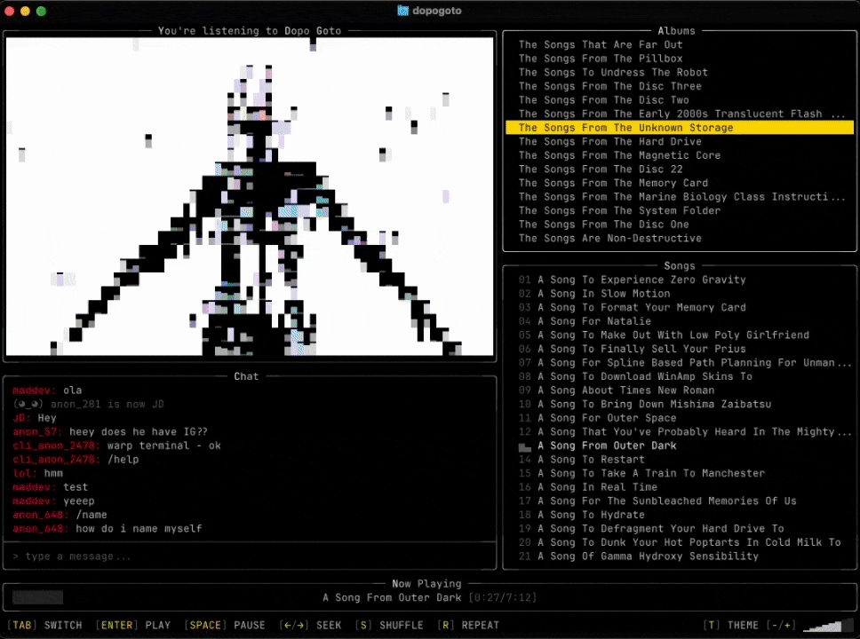

# Dopo Goto

Dopo Goto is a terminal-native audiovisual experience.<br>
15 albums. 30+ hours of music. Live chat.<br>
All in your command line.

Welcome to A Brand New World!



## Installation

Already installed? See [Updating](#updating).

### Ask AI

Paste this into Claude Code, Codex, Cursor, or any AI agent with terminal access:

> Install dopogoto terminal music player from github.com/dangerous-person/dopogoto

### macOS

1. Open **Terminal**.
2. Paste this command and press Enter:

```sh
curl -fsSL https://raw.githubusercontent.com/dangerous-person/dopogoto/main/install.sh | sh
```

3. If prompted, type your Mac password to allow install to `/usr/local/bin`.<br>
   (No characters appear while typing. This is normal.)
4. Start the app:

```sh
dopogoto
```

If Terminal says `command not found`, close Terminal, reopen it, and try `dopogoto` again.

### macOS (manual install, if the command above doesn't work)

1. Go to [Releases](https://github.com/dangerous-person/dopogoto/releases) and download the latest macOS file:
   `dopogoto_*_darwin_universal.tar.gz`
   (`darwin` means macOS, `universal` means it works on both Intel and Apple Silicon Macs).
2. Open Downloads in Finder and double-click the `.tar.gz` file.
   This creates a folder like `dopogoto_0.1.8_darwin_universal` containing the `dopogoto` app.
3. Open Terminal and run:

```sh
sudo mv ~/Downloads/dopogoto_*_darwin_universal/dopogoto /usr/local/bin/dopogoto
sudo chmod +x /usr/local/bin/dopogoto
xattr -d com.apple.quarantine /usr/local/bin/dopogoto 2>/dev/null || true
dopogoto
```

Keep `*` exactly as shown — it automatically matches the version folder name.

If you have multiple `dopogoto_*_darwin_universal` folders in Downloads, use the newest one, for example:

```sh
sudo mv ~/Downloads/dopogoto_0.1.8_darwin_universal/dopogoto /usr/local/bin/dopogoto
```

### Windows

1. Download `dopogoto_*_windows_amd64.zip` from [Releases](https://github.com/dangerous-person/dopogoto/releases)
2. Extract, and run `dopogoto.exe`.

### Linux

1. Download `dopogoto_*_linux_amd64.tar.gz` from [Releases](https://github.com/dangerous-person/dopogoto/releases)
2. Extract and install:

```sh
tar xzf dopogoto_*_linux_amd64.tar.gz
sudo mv dopogoto /usr/local/bin/dopogoto
sudo chmod +x /usr/local/bin/dopogoto
```

3. Install ALSA if you don't have it (required for audio):
   - Debian/Ubuntu: `sudo apt install libasound2-dev`
   - Fedora: `sudo dnf install alsa-lib-devel`
   - Arch: `sudo pacman -S alsa-lib`

4. Run `dopogoto`

Or use the one-liner:

```sh
curl -fsSL https://raw.githubusercontent.com/dangerous-person/dopogoto/main/install.sh | sh
```

### Build from source

Requires Go 1.25+:

```sh
go install github.com/dangerous-person/dopogoto@latest
```

## Requirements

- A 256-color terminal (Ghostty, Terminal.app, iTerm2, Windows Terminal, etc.)
- Terminal size 120x40 or larger
- Audio output device

**Linux:** ALSA is required for audio playback.
- Debian/Ubuntu: `sudo apt install libasound2-dev`
- Fedora: `sudo dnf install alsa-lib-devel`
- Arch: `sudo pacman -S alsa-lib`

## Updating

The app checks for updates on launch and shows a notification in chat when a new version is available.

### macOS

1. Quit dopogoto.
2. Open Terminal (Command+Space, type Terminal, press Enter).
3. Paste this command and press Enter (you can run it from any folder):

```sh
curl -fsSL https://raw.githubusercontent.com/dangerous-person/dopogoto/main/install.sh | sh
```

4. If prompted, type your Mac password and press Enter.
   No characters appear while typing — that's normal.
5. Then type `dopogoto` and press Enter.

### Windows

1. Close dopogoto.
2. Delete your old `dopogoto.exe` file.
3. Go to [Releases](https://github.com/dangerous-person/dopogoto/releases) and download the latest `dopogoto_*_windows_amd64.zip`.
4. Extract the ZIP and run the new `dopogoto.exe`.

### Linux

Quit dopogoto, then run:

```sh
curl -fsSL https://raw.githubusercontent.com/dangerous-person/dopogoto/main/install.sh | sh
```

Then run `dopogoto` again.

### If the version still looks old

Check your version:

```sh
dopogoto --version
```

On macOS / Linux, check if you have duplicate copies:

```sh
which -a dopogoto
```

If more than one path appears, delete the old one and restart your terminal.

## Controls

| Key | Action |
|-----|--------|
| `TAB` | Cycle focus: Albums / Tracks / Chat |
| `↑` / `↓` | Navigate lists |
| `ENTER` | Play track or send chat message |
| `SPACE` | Pause / resume |
| `N` / `P` | Next / previous track |
| `+` / `-` | Volume up / down |
| `S` | Shuffle |
| `R` | Repeat |
| `T` | Change theme |
| `←`/`→` | Seek -/+ 10s |
| `Q` | Quit |

## Chat

Type a message and press Enter.

- `/nick name` -- set your nickname (saved locally)
- `/reset` -- go anonymous

## Telemetry

Anonymous usage stats on launch and quit (version, OS, session duration, terminal size). No personal info. No IP tracking.

To opt out: `export DOPOGOTO_NO_TELEMETRY=1`

## Licensing

- Source code is licensed under MIT (see `LICENSE`).
- Media/assets are licensed separately (see [ASSETS_LICENSE.md](ASSETS_LICENSE.md)) and are not covered by MIT.

## Links
- https://www.youtube.com/@dopogoto
- https://dopogoto.bandcamp.com
- https://dopogoto.com
